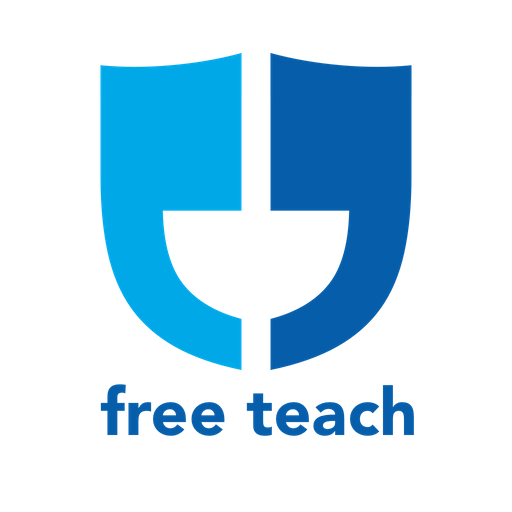

  

# Free Teach

## What is it?
Free Teach is a lecture series club where like-minded individuals get together to teach and learn. At a club meeting, everyone is required to prepare a lecture that spans from ten to thirty minutes. After each lecture, time will be allotted for questions and debate. Free Teach meetings provide a healthy and civil environment for discussing all kinds of ideologies. Participants will be challenged on their ideas, never their character for having controversial opinions.  

## What is the purpose?
The purpose of Free Teach meetings are to spread new ideas and to change perspectives on current ones. 
* **Lecturing:** *“Those who know, do. Those that understand, teach.”* - Aristotle. Truly understanding a topic means you should be able to teach it. When you are passionate about something, it can be empowering to talk about it with others who will give you their undivided attention and return great feedback. 
* **Listening:** Gather with a group of diverse people and get deep insights on topics you may have never heard of before. Rediscover the ideas in your head by listening to them from an alternative view.

## Consider
Prior to the event, the host and/or hostess should consider the following:
* **Passion, diversity, and respectfulness among attendees:** Anyone admitted to the event should be feel compelled to speak up and discuss their views and opinions with others. A diverse crowd will guarantee a diverse set of views and opinions to discuss. And most importantly, everyone should be exceedingly respectful of everyone else in the room.
* **Timing:** It is difficult to keep things on schedule. Consider using a timer for the lecturer that is visible for them to see the entire duration of their lecture. Questions and discussions after the lectures may be worthy of extra time.
* **Hospitality:** Consider providing food and drinks for the guests. Are bathrooms clean and available? 
* **Infrastructure:** Test the infrastructure prior to the event. Can the computer that has the presentation slides be easily connected to a TV? Is a mic necessary and present? Is there enough seating available for the event?
* **Presentations:** Be sure to receive all the presentation slides from the speakers prior to the event, and have them in the cloud in case a device does not work.
* **Program (20+ attendees):** If a large event is hosted, consider a program that consists of the speakers and their industry-specific knowledge, along with a general overview of the event and a schedule.

## Scheduling
The optimal scheduling for a Free Teach meeting is as follows:
* **Socialize:** Have everyone in the room get acquainted, as the debates may get... animated. (30 minutes)
* **Lecture + Questions:** (2-3 hours) Lecturing, keep track of the topics that need to be discussed further but got cut off by timing. 
* **Open Debate:** (Unlimited) Resume the discussion on the topics that have not been settled during the lectures.

### Sample Schedule
* **7:30 - 8:00** Socializing
* **8:00 - 10:00** Four, twenty-minute lectures with ten minutes allotted for questions afterward.
* **11:00 -** Open debate
